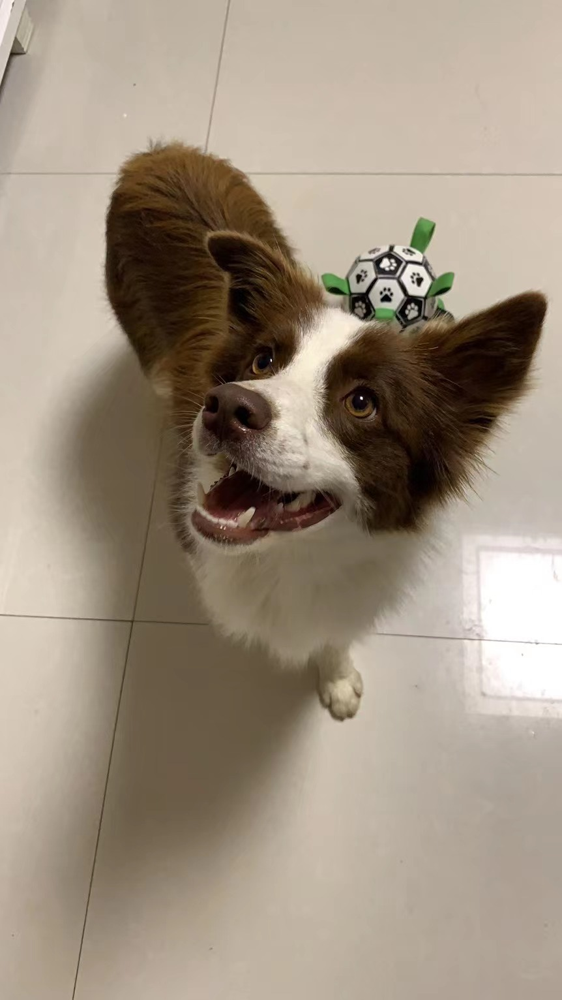

<!-- mp4格式 -->
<video src="./32_1703773819.mp4" controls>
</video>

1. 边牧的基础知识
- 全称：边境牧羊犬
- 经典的（黑白色） 七白三通
 - 七白：指的是四条腿白，尾巴尖白，围脖白，鼻线白，一共七处白色。
 - 三通：指的是围脖通，鼻线跟围脖通，肚子的白色跟腿上的白色通。
- 雄性的肩高范围在19—22英寸(48–56cm)；雌性的肩高范围在18—21英寸(46–53cm)。 
- 它们的寿命一般在10~14岁左右，这个数据比较官方，如果你喂养的好它们的寿命可远不止这么一点。
- 边牧的颜色有很多种大致可分为12种， 另外比较少见的有黑白三色，咖啡色，深貂色，马鞍色，黄白色，蓝陨石色，蓝陨石三色，丁香色，蓝白色，红陨石色。

1. 养狗的初衷？

- 抖音 陈贝拉， 露娜

2. 养狗需要注意的点？
- 禁: 葡萄  巧克力
- 尽量不要吃重盐的食物 
- 驱虫 体内（体外） 断奶 30多天
  疫苗 （3针防病毒）（1针狂犬）
        

